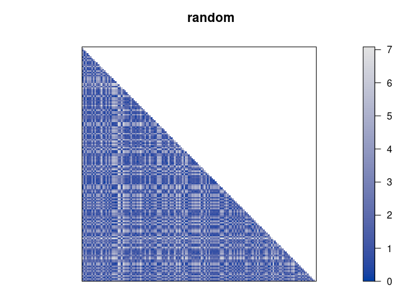
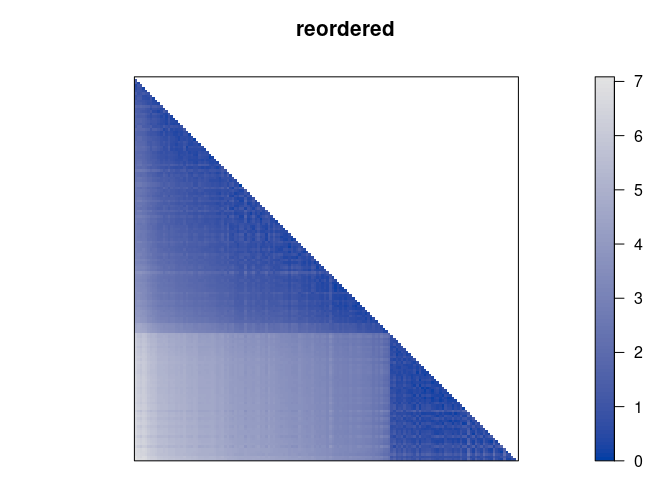

#  R package seriation - Infrastructure for Ordering Objects Using Seriation

[](https://CRAN.R-project.org/package=seriation)
[](https://mhahsler.r-universe.dev/seriation)
[](https://CRAN.R-project.org/package=seriation)

This package provides the infrastructure for ordering objects with an
implementation of several
[seriation](https://en.wikipedia.org/wiki/Seriation_(archaeology))/sequencing/[ordination](https://en.wikipedia.org/wiki/Ordination_(statistics))
techniques to reorder matrices, dissimilarity matrices, and dendrograms
(see below for a full list). Also provides (optimally) reordered
heatmaps, color images and clustering visualizations like dissimilarity
plots, and visual assessment of cluster tendency plots (VAT and iVAT).

## Available Seriation Method

The following methods are available to reorder dissimilarity data:

- **ARSA** - Simulated annealing (linear seriation)  
- **Branch-and-bound** to minimize the unweighted/weighted column
  gradient
- **DendSer** - Dendrogram seriation heuristic to optimize various
  criteria
- **GA** - Genetic algorithm with warm start to optimize various
  criteria
- **GW** - Hierarchical clustering reordered by Gruvaeus and Wainer
  heuristic
- **HC** - Hierarchical clustering (single link, avg. link, complete
  link)
- **Identity** permutation
- **MDS** - Multidimensional scaling (metric, non-metric, angle)
- **OLO** - Hierarchical clustering with optimal leaf ordering
- **OPTICS** - Ordering points to identify the clustering structure.
- **QAP** - Quadratic assignment problem heuristic (2-SUM, linear
  seriation, inertia, banded anti-Robinson form)
- **R2E** - Rank-two ellipse seriation
- **Random** permutation
- **Spectral** seriation (unnormalized, normalized)
- **SPIN** - Sorting points into neighborhoods (neighborhood algorithm,
  side-to-site algorithm)
- **TSP** - Traveling sales person solver to minimize the Hamiltonian
  path length
- **TSNE** - Order of the 1D t-distributed stochastic neighbor embedding
  (t-SNE)
- **UMAP** - Order of the 1D embedding produced by uniform manifold
  approximation and projection
- **VAT** - Order of the visual assessment of clustering tendency
  ordering

A detailed comparison of the methods is available in the paper [An
experimental comparison of seriation methods for one-mode two-way
data.](http://dx.doi.org/10.1016/j.ejor.2016.08.066) (read the
[preprint](https://michael.hahsler.net/research/paper/EJOR_seriation_2016.pdf)).

The following methods are available to reorder rows and columns of
matrices:

- **BEA** - Bond Energy Algorithm to maximize the measure of
  effectiveness (ME)
- **CA** - calculates a correspondence analysis of a matrix of
  frequencies and reorders according to the scores on a correspondence
  analysis dimension
- **Identity** permutation
- **PCA** - orders along the first principal component or angle on the
  projection on the first two principal components
- **Random** permutation
- **TSP** - Traveling sales person solver to maximize ME

## Installation

**Stable CRAN version:** Install from within R with

``` r
install.packages("seriation")
```

**Current development version:** Install from
[r-universe.](https://mhahsler.r-universe.dev/seriation)

``` r
install.packages("seriation", repos = "https://mhahsler.r-universe.dev")
```

## Usage

Load library, read data and calculate distances. Then use default
seriation. The used dataset contains the joint probability of
disagreement between Supreme Court Judges during the period from 1995 to
2002.

``` r
library(seriation)
data("SupremeCourt")

SupremeCourt
```

    ##           Breyer Ginsburg Kennedy OConnor Rehnquist Scalia Souter Stevens
    ## Breyer      0.00    0.120    0.25    0.21      0.30  0.353  0.118    0.16
    ## Ginsburg    0.12    0.000    0.27    0.25      0.31  0.370  0.096    0.15
    ## Kennedy     0.25    0.267    0.00    0.16      0.12  0.188  0.248    0.33
    ## OConnor     0.21    0.252    0.16    0.00      0.16  0.207  0.220    0.33
    ## Rehnquist   0.30    0.308    0.12    0.16      0.00  0.143  0.293    0.40
    ## Scalia      0.35    0.370    0.19    0.21      0.14  0.000  0.338    0.44
    ## Souter      0.12    0.096    0.25    0.22      0.29  0.338  0.000    0.17
    ## Stevens     0.16    0.145    0.33    0.33      0.40  0.438  0.169    0.00
    ## Thomas      0.36    0.368    0.18    0.21      0.14  0.066  0.331    0.44
    ##           Thomas
    ## Breyer     0.359
    ## Ginsburg   0.368
    ## Kennedy    0.177
    ## OConnor    0.205
    ## Rehnquist  0.137
    ## Scalia     0.066
    ## Souter     0.331
    ## Stevens    0.436
    ## Thomas     0.000

``` r
d <- as.dist(SupremeCourt)
order <- seriate(d)
order
```

    ## object of class 'ser_permutation', 'list'
    ## contains permutation vectors for 1-mode data
    ## 
    ##   vector length seriation method
    ## 1             9         Spectral

Get the resulting permutation vector.

``` r
get_order(order)
```

    ##    Scalia    Thomas Rehnquist   Kennedy   OConnor    Souter    Breyer  Ginsburg 
    ##         6         9         5         3         4         7         1         2 
    ##   Stevens 
    ##         8

``` r
pimage(d, diag = TRUE, upper = TRUE, main = "judges in original alphabetical order")
pimage(d, order, diag = TRUE, upper = TRUE, main = "judges reordered by seriation")
```



Compare serveral available quality metrics.

``` r
rbind(alphabetical = criterion(d), seriated = criterion(d, order))
```

    ##              2SUM AR_deviations AR_events BAR Cor_R Gradient_raw
    ## alphabetical  872        10.304        80 1.8 0.024            8
    ## seriated      811         0.064         5 1.1 0.085          158
    ##              Gradient_weighted Inertia Lazy_path_length Least_squares LS  ME
    ## alphabetical              0.54     267              6.9           967 99  99
    ## seriated                 19.76     364              4.6           942 86 101
    ##              Moore_stress Neumann_stress Path_length RGAR
    ## alphabetical          7.0            3.9         1.8 0.48
    ## seriated              2.5            1.3         1.1 0.03

## References

- Michael Hahsler, Kurt Hornik and Christian Buchta, [Getting Things in
  Order: An Introduction to the R Package
  seriation,](http://dx.doi.org/10.18637/jss.v025.i03) *Journal of
  Statistical Software,* 25(3), 2008.
- Michael Hahsler. [An experimental comparison of seriation methods for
  one-mode two-way data.](http://dx.doi.org/10.1016/j.ejor.2016.08.066)
  *European Journal of Operational Research,* 257:133-143, 2017. (read
  the
  [preprint](https://michael.hahsler.net/research/paper/EJOR_seriation_2016.pdf))
- [Reference manual for package
  seriation.](https://www.rdocumentation.org/packages/seriation/)
