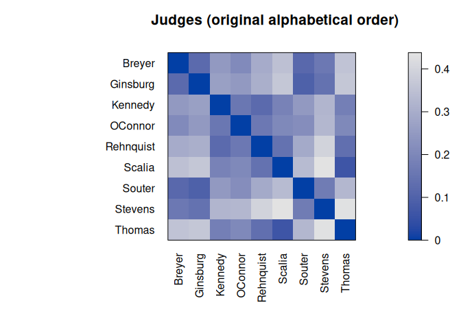

# R package seriation - Infrastructure for Ordering Objects Using Seriation

[](https://CRAN.R-project.org/package=seriation)
[](https://mhahsler.r-universe.dev/ui#package:seriation)
[](https://CRAN.R-project.org/package=seriation)

This package provides the infrastructure for ordering objects with an
implementation of several
[seriation](https://en.wikipedia.org/wiki/Seriation_(archaeology))/sequencing/[ordination](https://en.wikipedia.org/wiki/Ordination_(statistics))
techniques to reorder matrices, dissimilarity matrices, and dendrograms
(see below for a full list). Also provides (optimally) reordered
heatmaps, color images and clustering visualizations like dissimilarity
plots, and visual assessment of cluster tendency plots (VAT and iVAT).

## Available Seriation Method

The following methods are available for dissimilarity data:

-   **ARSA** - Simulated annealing (linear seriation)  
-   **Branch-and-bound** to minimize the unweighted/weighted column
    gradient
-   **DendSer** - Dendrogram seriation heuristic to optimize various
    criteria
-   **GA** - Genetic algorithm with warm start to optimize various
    criteria
-   **GW** - Hierarchical clustering reordered by Gruvaeus and Wainer
    heuristic
-   **HC** - Hierarchical clustering (single link, avg. link, complete
    link)
-   **Identity** permutation
-   **MDS** - Multidimensional scaling (metric, non-metric, angle)
-   **OLO** - Hierarchical clustering with optimal leaf ordering
-   **OPTICS** - Ordering points to identify the clustering structure.
-   **QAP** - Quadratic assignment problem heuristic (2-SUM, linear
    seriation, inertia, banded anti-Robinson form)
-   **R2E** - Rank-two ellipse seriation
-   **Random** permutation
-   **Spectral** seriation (unnormalized, normalized)
-   **SPIN** - Sorting points into neighborhoods (neighborhood
    algorithm, side-to-site algorithm)
-   **TSP** - Traveling sales person solver to minimize the Hamiltonian
    path length
-   **TSNE** - Order of the 1D t-distributed stochastic neighbor
    embedding (t-SNE)
-   **UMAP** - Order of the 1D embedding produced by uniform manifold
    approximation and projection
-   **VAT** - Order of the visual assessment of clustering tendency
    ordering

A detailed comparison of the methods is available in the paper [An
experimental comparison of seriation methods for one-mode two-way
data.](http://dx.doi.org/10.1016/j.ejor.2016.08.066) (read the
[preprint](https://michael.hahsler.net/research/paper/EJOR_seriation_2016.pdf)).

The following methods are available for matrices:

-   **BEA** - Bond Energy Algorithm to maximize the measure of
    effectiveness (ME)
-   **Identity** permutation
-   **PCA** - First principal component or angle on the projection on
    the first two principal components
-   **Random** permutation
-   **TSP** - Traveling sales person solver to maximize ME

## Installation

**Stable CRAN version:** Install from within R with

``` r
install.packages("seriation")
```

**Current development version:** Install from
[r-universe.](https://mhahsler.r-universe.dev/ui#package:seriation)

``` r
install.packages("seriation", repos = "https://mhahsler.r-universe.dev")
```

## Usage

Load library, read data and calculate distances. Then use default
seriation.

``` r
library(seriation)
data("iris")
x <- as.matrix(iris[-5])
x <- x[sample(1:nrow(x)), ]

d <- dist(x)
order <- seriate(d)
order
```

    ## object of class 'ser_permutation', 'list'
    ## contains permutation vectors for 1-mode data
    ## 
    ##   vector length seriation method
    ## 1           150         Spectral

``` r
pimage(d, main = "random")
```

<!-- -->

``` r
pimage(d, order, main = "reordered")
```

<!-- -->

Compare quality.

``` r
rbind(random = criterion(d), reordered = criterion(d, order))
```

    ##              2SUM AR_deviations AR_events    BAR Cor_R Gradient_raw
    ## random    3.0e+07        940286    547092 165667 0.012         7828
    ## reordered 1.8e+07          9887     54924  56610 0.372       992058
    ##           Gradient_weighted Inertia Lazy_path_length Least_squares      LS   ME
    ## random                13138 2.2e+08            29897       7.9e+07 5659558 5741
    ## reordered           1771427 3.6e+08             6706       7.6e+07 4487365 7254
    ##           Moore_stress Neumann_stress Path_length RGAR
    ## random           12184           6506         402 0.50
    ## reordered         1112            539          91 0.05

## References

-   Michael Hahsler, Kurt Hornik and Christian Buchta, [Getting Things
    in Order: An Introduction to the R Package
    seriation,](http://dx.doi.org/10.18637/jss.v025.i03) *Journal of
    Statistical Software,* 25(3), 2008.
-   Michael Hahsler. [An experimental comparison of seriation methods
    for one-mode two-way
    data.](http://dx.doi.org/10.1016/j.ejor.2016.08.066) *European
    Journal of Operational Research,* 257:133-143, 2017. (read the
    [preprint](https://michael.hahsler.net/research/paper/EJOR_seriation_2016.pdf))
-   [Reference manual for package
    seriation.](https://www.rdocumentation.org/packages/seriation/)
-   [Seriation package
    vignette](https://cran.r-project.org/package=seriation/vignettes/seriation.pdf)
    with complete examples.
