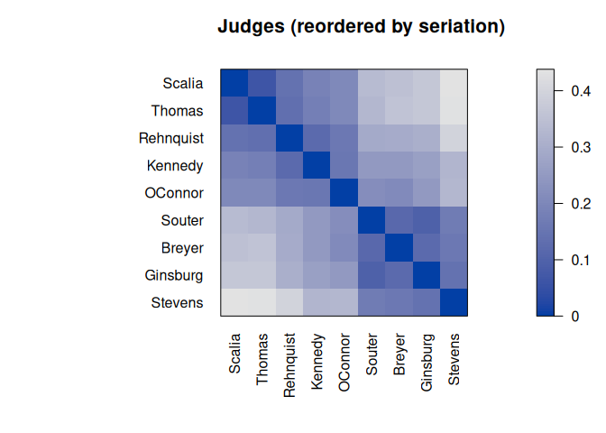
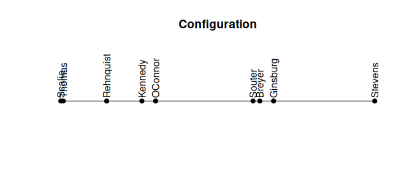

#  R package seriation - Infrastructure for Ordering Objects Using Seriation

[](https://CRAN.R-project.org/package=seriation)
[](https://mhahsler.r-universe.dev/seriation)
[](https://CRAN.R-project.org/package=seriation)

## Introduction

Seriation arranges a set of objects into a linear order given available
data with the goal of revealing structural information. This package
provides the infrastructure for ordering objects with an implementation
of many
[seriation](https://en.wikipedia.org/wiki/Seriation_(archaeology))/sequencing/[ordination](https://en.wikipedia.org/wiki/Ordination_(statistics))
techniques to reorder data matrices, dissimilarity matrices, correlation
matrices, and dendrograms (see below for a complete list). The package
provides several visualizations (grid and ggplot2) to reveal structural
information, including permuted image plots, reordered heatmaps, Bertin
plots, clustering visualizations like dissimilarity plots, and visual
assessment of cluster tendency plots (VAT and iVAT).

Here are some quick guides for

- [reordered
  heatmaps.](https://mhahsler.github.io/seriation/heatmaps.html)
- [reordered correlation matrices](https://taiyun.github.io/corrplot/)
  (using seriation in package corrplot).
- [a visual comparison between seriation
  methods.](https://mhahsler.github.io/seriation/visual_comparison.html)

The following R packages use `seriation`:
[adepro](https://CRAN.R-project.org/package=adepro),
[arulesViz](https://CRAN.R-project.org/package=arulesViz),
[baizer](https://CRAN.R-project.org/package=baizer),
[ChemoSpec](https://CRAN.R-project.org/package=ChemoSpec),
[ClusteredMutations](https://CRAN.R-project.org/package=ClusteredMutations),
[corrgram](https://CRAN.R-project.org/package=corrgram),
[corrplot](https://CRAN.R-project.org/package=corrplot),
[corrr](https://CRAN.R-project.org/package=corrr),
[dendextend](https://CRAN.R-project.org/package=dendextend),
[DendSer](https://CRAN.R-project.org/package=DendSer),
[dendsort](https://CRAN.R-project.org/package=dendsort),
[disclapmix](https://CRAN.R-project.org/package=disclapmix),
[elaborator](https://CRAN.R-project.org/package=elaborator),
[flexclust](https://CRAN.R-project.org/package=flexclust),
[ggraph](https://CRAN.R-project.org/package=ggraph),
[heatmaply](https://CRAN.R-project.org/package=heatmaply),
[MEDseq](https://CRAN.R-project.org/package=MEDseq),
[ockc](https://CRAN.R-project.org/package=ockc),
[pergola](https://CRAN.R-project.org/package=pergola),
[protti](https://CRAN.R-project.org/package=protti),
[RMaCzek](https://CRAN.R-project.org/package=RMaCzek),
[SFS](https://CRAN.R-project.org/package=SFS),
[tidygraph](https://CRAN.R-project.org/package=tidygraph),
[treeheatr](https://CRAN.R-project.org/package=treeheatr),
[vcdExtra](https://CRAN.R-project.org/package=vcdExtra)

Please cite the use of this package as:

> Hahsler M, Hornik K, Buchta C (2008). “Getting things in order: An
> introduction to the R package seriation.” *Journal of Statistical
> Software*, *25*(3), 1-34. ISSN 1548-7660, <doi:10.18637/jss.v025.i03>
> <https://doi.org/10.18637/jss.v025.i03>.

    @Article{,
      title = {Getting things in order:  An introduction to the R package seriation},
      author = {Michael Hahsler and Kurt Hornik and Christian Buchta},
      year = {2008},
      journal = {Journal of Statistical Software},
      volume = {25},
      number = {3},
      pages = {1--34},
      doi = {10.18637/jss.v025.i03},
      month = {March},
      issn = {1548-7660},
    }

## Installation

**Stable CRAN version:** Install from within R with

``` r
install.packages("seriation")
```

**Current development version:** Install from
[r-universe.](https://mhahsler.r-universe.dev/seriation)

``` r
install.packages("seriation", repos = "https://mhahsler.r-universe.dev")
```

## Usage

The used example dataset contains the joint probability of disagreement
between Supreme Court Judges from 1995 to 2002. The goal is to reveal
structural information in this data. We load the library, read the data,
convert the data to distances, and then use the default seriation method
to reorder the objects.

``` r
library(seriation)
data("SupremeCourt")

SupremeCourt
```

    ##           Breyer Ginsburg Kennedy OConnor Rehnquist Scalia Souter Stevens
    ## Breyer      0.00    0.120    0.25    0.21      0.30  0.353  0.118    0.16
    ## Ginsburg    0.12    0.000    0.27    0.25      0.31  0.370  0.096    0.15
    ## Kennedy     0.25    0.267    0.00    0.16      0.12  0.188  0.248    0.33
    ## OConnor     0.21    0.252    0.16    0.00      0.16  0.207  0.220    0.33
    ## Rehnquist   0.30    0.308    0.12    0.16      0.00  0.143  0.293    0.40
    ## Scalia      0.35    0.370    0.19    0.21      0.14  0.000  0.338    0.44
    ## Souter      0.12    0.096    0.25    0.22      0.29  0.338  0.000    0.17
    ## Stevens     0.16    0.145    0.33    0.33      0.40  0.438  0.169    0.00
    ## Thomas      0.36    0.368    0.18    0.21      0.14  0.066  0.331    0.44
    ##           Thomas
    ## Breyer     0.359
    ## Ginsburg   0.368
    ## Kennedy    0.177
    ## OConnor    0.205
    ## Rehnquist  0.137
    ## Scalia     0.066
    ## Souter     0.331
    ## Stevens    0.436
    ## Thomas     0.000

``` r
d <- as.dist(SupremeCourt)
order <- seriate(d)
order
```

    ## object of class 'ser_permutation', 'list'
    ## contains permutation vectors for 1-mode data
    ## 
    ##   vector length seriation method
    ## 1             9         Spectral

Get the resulting permutation vector and visualize the permuted distance
matrix. Darker squares around the main diagonal show groups of similar
objects. After seriation, two groups are visible.

``` r
get_order(order)
```

    ##    Scalia    Thomas Rehnquist   Kennedy   OConnor    Souter    Breyer  Ginsburg 
    ##         6         9         5         3         4         7         1         2 
    ##   Stevens 
    ##         8

``` r
pimage(d, main = "judges in original alphabetical order")
pimage(d, order, main = "judges reordered by seriation")
```



Compare the available seriation criteria. Seriation improved all (Note:
some measures are merit measures while others represent cost. See the
manual page for details).

``` r
rbind(alphabetical = criterion(d), seriated = criterion(d, order))
```

    ##              2SUM AR_deviations AR_events BAR Gradient_raw Gradient_weighted
    ## alphabetical  872        10.304        80 1.8            8              0.54
    ## seriated      811         0.064         5 1.1          158             19.76
    ##              Inertia Lazy_path_length Least_squares LS MDS_stress  ME
    ## alphabetical     267              6.9           967 99       0.62  99
    ## seriated         364              4.6           942 86       0.17 101
    ##              Moore_stress Neumann_stress Path_length RGAR   Rho
    ## alphabetical          7.0            3.9         1.8 0.48 0.028
    ## seriated              2.5            1.3         1.1 0.03 0.913

Some seriation methods also return a linear configuration where more
similar objects are located closer to each other. We can see a clear
divide between the two groups.

``` r
get_config(order)
```

    ##    Breyer  Ginsburg   Kennedy   OConnor Rehnquist    Scalia    Souter   Stevens 
    ##      0.24      0.28     -0.15     -0.11     -0.27     -0.42      0.21      0.61 
    ##    Thomas 
    ##     -0.41

``` r
plot_config(order)
```

<!-- -->

## Available seriation methods to reorder dissimilarity data

Seriation methods for dissimilarity data reorder the set of objects in
the data. The methods fall into several groups based on the criteria
they try to optimize, constraints (like dendrograms), and the
algorithmic approach.

### Dendrogram leaf order

These methods create a dendrogram using hierarchical clustering and then
derive the seriation order from the leaf order in the dendrogram. Leaf
reordering may be applied.

- **DendSer** - Dendrogram seriation heuristic to optimize various
  criteria
- **GW** - Hierarchical clustering reordered by the Gruvaeus and Wainer
  heuristic
- **HC** - Hierarchical clustering (single link, avg. link, complete
  link)
- **OLO** - Hierarchical clustering with optimal leaf ordering

### Dimensionality reduction

Find a seriation order by reducing the dimensionality to 1 dimension.
This is typically done by minimizing a stress measure or the
reconstruction error.

- **MDS** - classical metric multidimensional scaling
- **MDS (angle)** - order by the angle in 2D principal coordinates space
- **isoMDS** - 1D Krusakl’s non-metric multidimensional scaling
- **isomap** - 1D isometric feature mapping ordination
- **monoMDS** - order along 1D global and local non-metric
  multidimensional scaling using monotone regression (NMDS)
- **metaMDS** - 1D non-metric multidimensional scaling (NMDS) with
  stable solution from random starts
- **Sammon** - Order along the 1D Sammon’s non-linear mapping
- **smacof** - 1D MDS using majorization (ratio MDS, interval MDS,
  ordinal MDS)
- **TSNE** - Order along the 1D t-distributed stochastic neighbor
  embedding (t-SNE)
- **UMAP** - Order along the 1D embedding produced by uniform manifold
  approximation and projection

### Optimization

These methods try to optimize a seriation criterion directly, typically
using a heuristic approach.

- **ARSA** - optimize the linear seriation critreion using simulated
  annealing  
- **Branch-and-bound** to minimize the unweighted/weighted column
  gradient
- **GA** - Genetic algorithm with warm start to optimize any seriation
  criteria
- **GSA** - General simulated annealing to optimize any seriation
  criteria
- **QAP** - Quadratic assignment problem heuristic (optimizes 2-SUM,
  linear seriation, inertia, banded anti-Robinson form)
- **Spectral** seriation to optimize the 2-SUM criterion (unnormalized,
  normalized)
- **TSP** - Traveling salesperson solver to minimize the Hamiltonian
  path length

### Other Methods

- **Identity** permutation
- **OPTICS** - Order of ordering points to identify the clustering
  structure
- **R2E** - Rank-two ellipse seriation
- **Random** permutation
- **Reverse** order
- **SPIN** - Sorting points into neighborhoods (neighborhood algorithm,
  side-to-site algorithm)
- **VAT** - Order of the visual assessment of clustering tendency

A detailed comparison of the most popular methods is available in the
paper [An experimental comparison of seriation methods for one-mode
two-way data.](http://dx.doi.org/10.1016/j.ejor.2016.08.066) (read the
[preprint](https://michael.hahsler.net/research/paper/EJOR_seriation_2016.pdf)).

## Available seriation methods to reorder data matrices, count tables, and data.frames

For matrices, rows and columns are reordered.

### Seriating rows and columns simultaneously

Row and column order influence each other.

- **BEA** - Bond Energy Algorithm to maximize the measure of
  effectiveness (ME)
- **BEA_TSP** - TSP to optimize the measure of effectiveness
- **CA** - calculates a correspondence analysis of a matrix of
  frequencies (count table) and reorders according to the scores on a
  correspondence analysis dimension

### Seriating rows and columns separately using dissimilarities

- **Heatmap** - reorders rows and columns independently by calculating
  row/column distances and then applying a seriation method for
  dissimilarities (see above)

### Seriate rows in a data matrix

These methods need access to the data matrix instead of dissimilarities
to reorder objects (rows). The same approach can be applied to columns.

- **LLE** reorder along a 1D locally linear embedding
- **Means** - reorders using row and column means
- **PCA** - orders along the first principal component
- **PCA (angle)** - orders by the angle on the projection on the first
  two principal components
- **TSNE** - Order along the 1D t-distributed stochastic neighbor
  embedding (t-SNE)
- **UMAP** - Order along the 1D embedding produced by uniform manifold
  approximation and projection

### Other methods

- **Identity** permutation
- **Random** permutation
- **Reverse** order

## References

- Michael Hahsler, Kurt Hornik and Christian Buchta, [Getting Things in
  Order: An Introduction to the R Package
  seriation,](http://dx.doi.org/10.18637/jss.v025.i03) *Journal of
  Statistical Software,* 25(3), 2008. DOI: 10.18637/jss.v025.i03
- Michael Hahsler. [An experimental comparison of seriation methods for
  one-mode two-way data.](http://dx.doi.org/10.1016/j.ejor.2016.08.066)
  *European Journal of Operational Research,* 257:133-143, 2017. DOI:
  10.1016/j.ejor.2016.08.066 (read the
  [preprint](https://michael.hahsler.net/research/paper/EJOR_seriation_2016.pdf))
- [Reference manual for package
  seriation.](https://www.rdocumentation.org/packages/seriation/)
