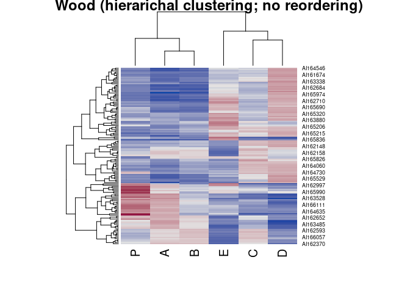
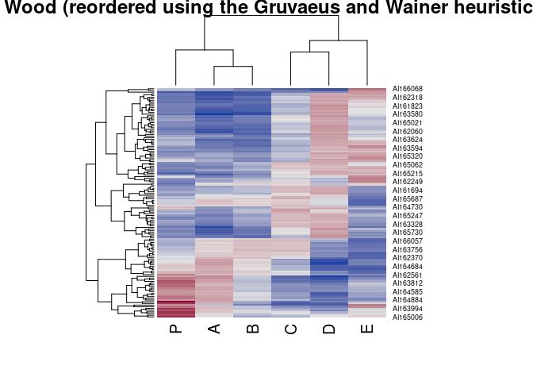
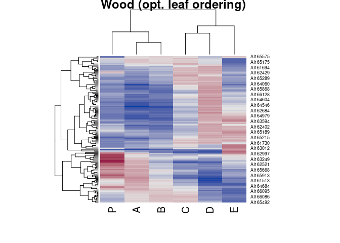
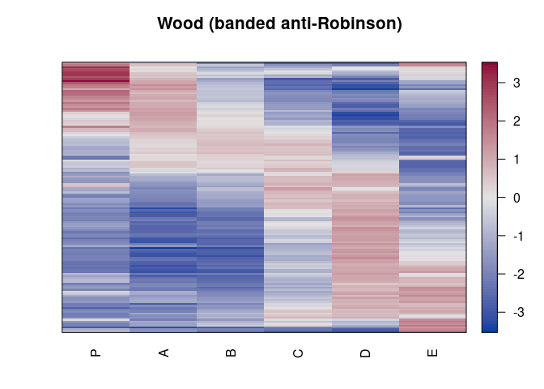
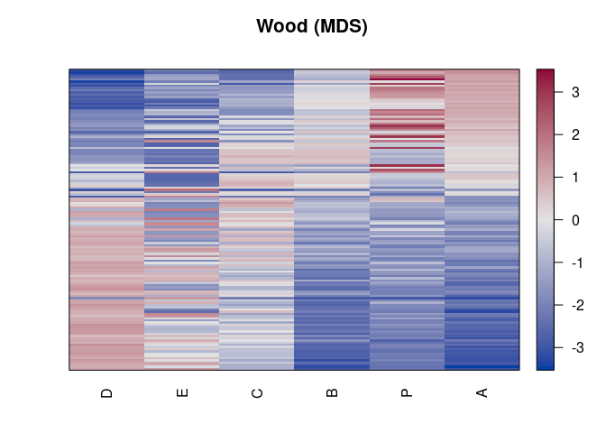
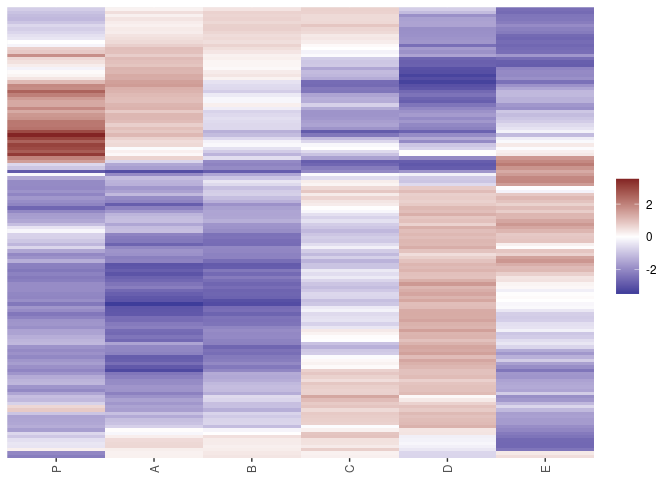

# Heatmaps with Package Seriation
Michael Hahsler

The package seriation can be used for reordering heatmaps and displaying
them using the functions

-   `hmap()`
-   `gghmap()`

There functions can be used as a direct replacement of `heatmap()` in
the R package `stats`.

## Standard Heatmaps

Here are some typical reordering schemes.

``` r
library("seriation")
data("Wood")
```

``` r
hmap(Wood, method = "HC", main = "Wood (hierarichal clustering; no reordering)")
```



``` r
hmap(Wood, method = "GW", main = "Wood (reordered using the Gruvaeus and Wainer heuristic)")
```

    Registered S3 method overwritten by 'gclus':
      method         from     
      reorder.hclust seriation



``` r
hmap(Wood, method = "OLO", main = "Wood (opt. leaf ordering)")
```



Different linkage types can be added in the method name.

Package `DendSer` offers more dendrogram seriation methods. These
methods can be registered using \`register_DendSer()\`\`

``` r
register_DendSer()

hmap(Wood, method = "DendSer_BAR", main = "Wood (banded anti-Robinson)")
```



## Non-dendrogram-based seriation methods

These methods reorder rows and columns. No dendrogram is produced.

``` r
hmap(Wood, method = "MDS", main = "Wood (MDS)")
```



``` r
hmap(Wood, method = "Spectral", main = "Wood (MDS)")
```


## ggplot2 version

All options are also available for `ggplot2` using `gghmap()`. Currently
there is no support to display dendrograms.

``` r
library(ggplot2)
gghmap(Wood, method = "OLO")
```



Package `heatmaply` uses `seriation` to reorder interactive heatmaps.
