# A Comparison of Seriation Methods
Michael Hahsler

## Introduction

This vignette compares the seriation methods available in package using
the popular Iris data set and randomize the order of the objects.

``` r
library("seriation")

data("iris")
x <- as.matrix(iris[sample(nrow(iris)), -5])
d <- dist(x)
```

## Distance Seriation

``` r
register_DendSer()
```

    Registered S3 method overwritten by 'gclus':
      method         from     
      reorder.hclust seriation

    Registered new seriation method 'DendSer' for 'dist' 
    Registered new seriation method 'DendSer_BAR' for 'dist' 
    Registered new seriation method 'DendSer_PL' for 'dist' 
    Registered new seriation method 'DendSer_LPL' for 'dist' 
    Registered new seriation method 'DendSer_ARc' for 'dist' 
    Registered new seriation criteron 'ARc' for 'dist' 

``` r
register_optics()
```

    Registered new seriation method 'optics' for 'dist' 

``` r
register_smacof()
```

    Registered S3 methods overwritten by 'proxy':
      method               from    
      print.registry_field registry
      print.registry_entry registry

    Registered new seriation method 'MDS_smacof' for 'dist' 
    Registered new seriation criteron 'smacof_stress0' for 'dist' 

``` r
methods <- sort(list_seriation_methods("dist"))

# remove slow methods
methods <- setdiff(methods, c("BBURCG", "BBWRCG", "Enumerate", "GSA"))
methods 
```

     [1] "ARSA"           "DendSer"        "DendSer_ARc"    "DendSer_BAR"   
     [5] "DendSer_LPL"    "DendSer_PL"     "GW"             "GW_average"    
     [9] "GW_complete"    "GW_single"      "GW_ward"        "HC"            
    [13] "HC_average"     "HC_complete"    "HC_single"      "HC_ward"       
    [17] "Identity"       "isomap"         "isoMDS"         "MDS"           
    [21] "MDS_angle"      "MDS_smacof"     "metaMDS"        "monoMDS"       
    [25] "OLO"            "OLO_average"    "OLO_complete"   "OLO_single"    
    [29] "OLO_ward"       "optics"         "QAP_2SUM"       "QAP_BAR"       
    [33] "QAP_Inertia"    "QAP_LS"         "R2E"            "Random"        
    [37] "Reverse"        "Sammon_mapping" "Spectral"       "Spectral_norm" 
    [41] "SPIN_NH"        "SPIN_STS"       "TSP"            "VAT"           

``` r
orders <- list()
criterion <- list()
for (m in methods) {
  cat(m)
  tm <- system.time(orders[[m]] <- seriate(d, method = m))
  criterion[[m]] <- data.frame(time = tm[1]+tm[2], rbind(criterion(d, orders[[m]]))) 
  cat(" took", tm[1]+tm[2], "sec.\n")
}
```

    ARSA took 0.884 sec.
    DendSer took 0.125 sec.
    DendSer_ARc took 0.132 sec.
    DendSer_BAR took 0.13 sec.
    DendSer_LPL took 0.706 sec.
    DendSer_PL took 0.706 sec.
    GW took 0.109 sec.
    GW_average took 0.105 sec.
    GW_complete took 0.103 sec.
    GW_single took 0.104 sec.
    GW_ward took 0.104 sec.
    HC took 0.103 sec.
    HC_average took 0.104 sec.
    HC_complete took 0.101 sec.
    HC_single took 0.104 sec.
    HC_ward took 0.104 sec.
    Identity took 0.104 sec.
    isomap

    Registered S3 method overwritten by 'vegan':
      method         from 
      reorder.hclust gclus

     took 0.141 sec.
    isoMDS took 0.145 sec.
    MDS took 0.108 sec.
    MDS_angle took 0.111 sec.
    MDS_smacof took 0.126 sec.
    metaMDS took 0.421 sec.
    monoMDS took 0.12 sec.
    OLO took 0.107 sec.
    OLO_average took 0.108 sec.
    OLO_complete took 0.108 sec.
    OLO_single took 0.107 sec.
    OLO_ward took 0.108 sec.
    optics took 0.112 sec.
    QAP_2SUM took 0.124 sec.
    QAP_BAR took 0.119 sec.
    QAP_Inertia took 0.117 sec.
    QAP_LS took 0.124 sec.
    R2E took 0.122 sec.
    Random took 0.106 sec.
    Reverse took 0.106 sec.
    Sammon_mapping took 0.113 sec.
    Spectral took 0.115 sec.
    Spectral_norm took 0.114 sec.
    SPIN_NH took 0.408 sec.
    SPIN_STS took 0.512 sec.
    TSP took 0.109 sec.
    VAT took 0.107 sec.

``` r
criterion_mat <- do.call(rbind, criterion)
```

Align the seriation orders and sort from best to worst according to the
criterion measure `Gradient_weighted`.

``` r
orders_aligned <- ser_align(orders)
best_to_worse <- order(criterion_mat[["Gradient_weighted"]], decreasing = TRUE)

orders_aligned <- orders_aligned[best_to_worse]
criterion_mat <- criterion_mat[best_to_worse, ]
```

``` r
for (n in names(orders_aligned))
  pimage(d, orders_aligned[[n]], main = n , key = FALSE)
```


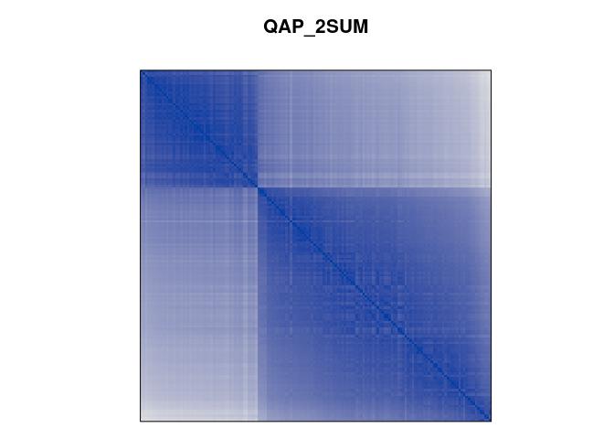


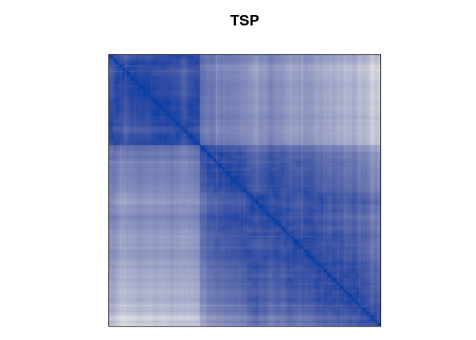


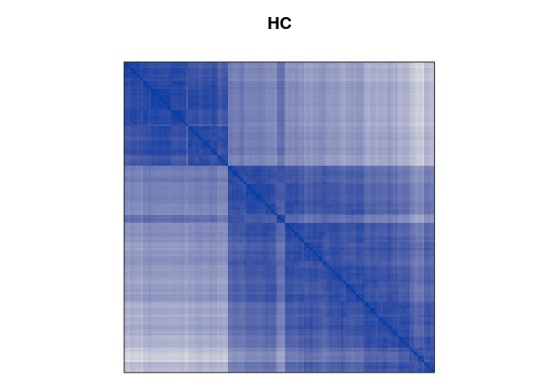

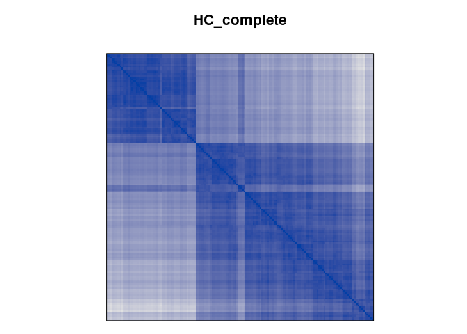


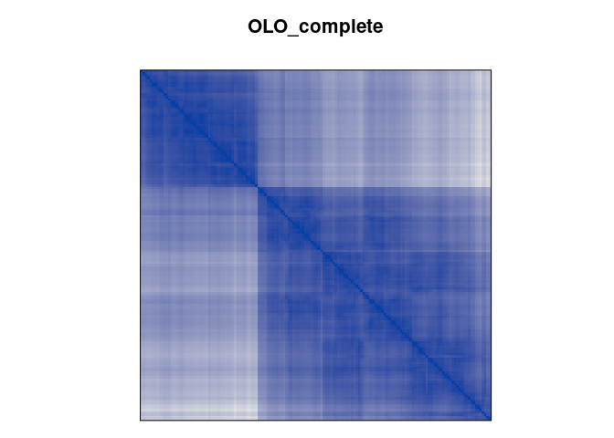

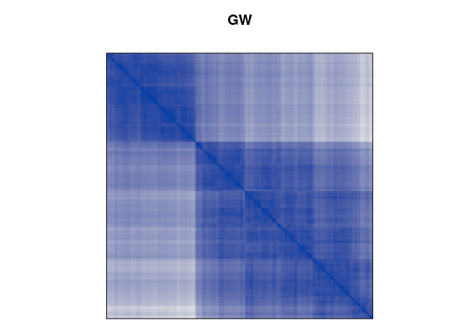

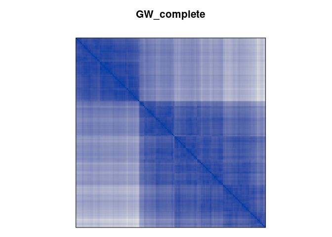


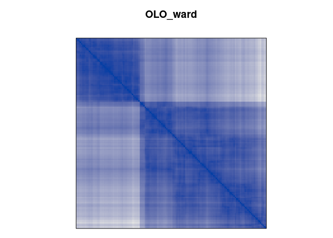


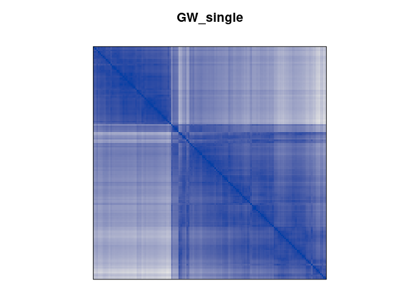


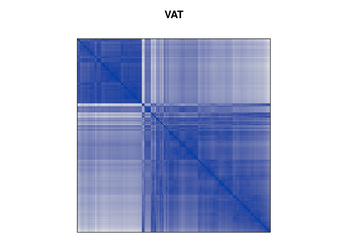

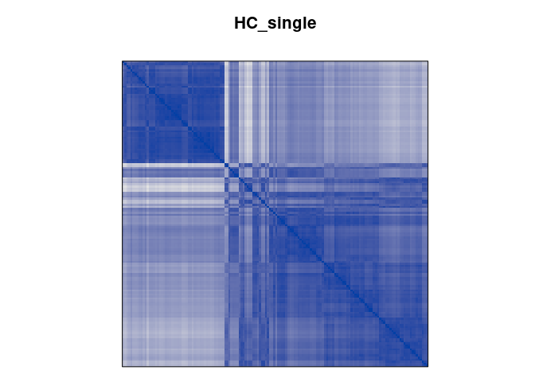

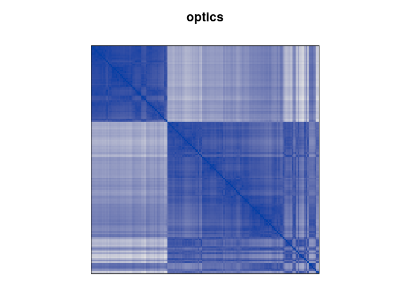


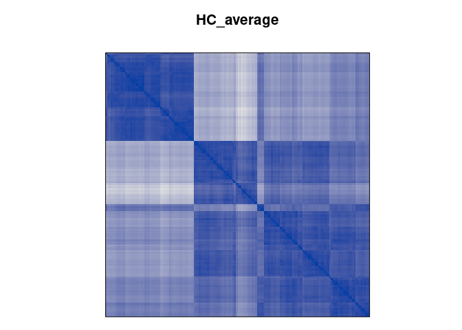


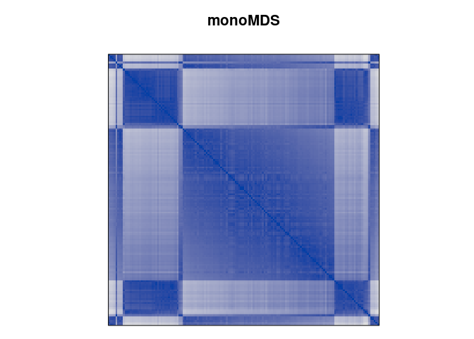

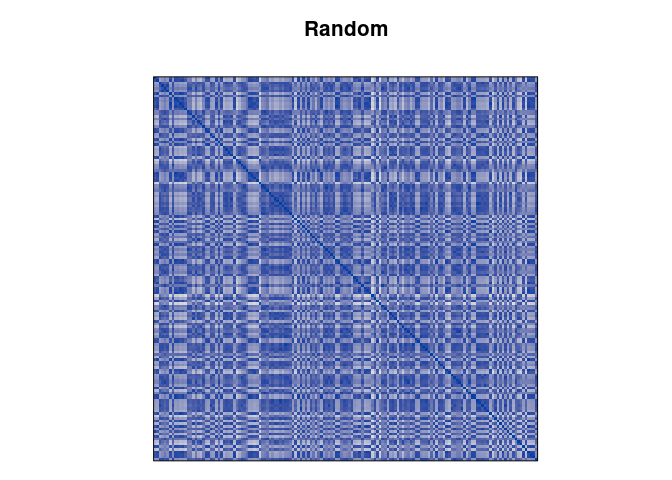

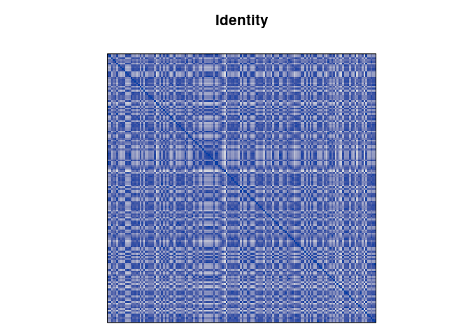


``` r
dst <- ser_dist(orders) 
hmap(dst)
```

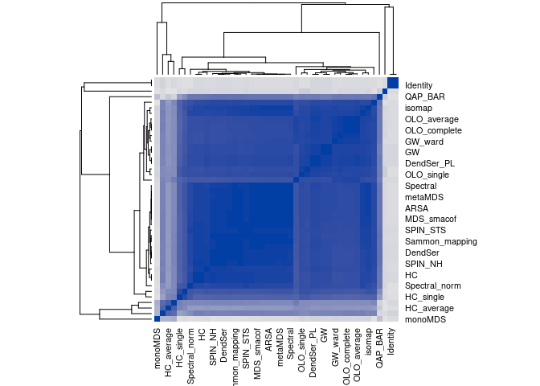

``` r
knitr::kable(criterion_mat)
```

|                |  time |    X2SUM | AR_deviations | AR_events |     ARc |       BAR | Gradient_raw | Gradient_weighted |   Inertia | Lazy_path_length | Least_squares |      LS | MDS_stress |       ME | Moore_stress | Neumann_stress | Path_length |      RGAR |       Rho | smacof_stress0 |
|:----|--:|--:|---:|---:|--:|---:|---:|----:|---:|----:|---:|--:|---:|--:|---:|----:|---:|---:|---:|----:|
| ARSA           | 0.884 | 17811233 |      9438.609 |     54823 | 2243449 |  56363.00 |       992260 |        1772128.25 | 356949760 |         6412.070 |      76487635 | 4486897 |  0.2289767 | 7268.327 |    1039.1137 |       480.3361 |    86.13776 | 0.0497216 | 0.9088803 |      0.2274711 |
| QAP_LS         | 0.124 | 17810752 |      9434.450 |     54818 | 2243449 |  56357.30 |       992270 |        1772126.43 | 356949177 |         6462.879 |      76487637 | 4486898 |  0.2289780 | 7267.789 |    1040.8228 |       482.4869 |    86.76879 | 0.0497170 | 0.9088963 |      0.2274723 |
| metaMDS        | 0.421 | 17813274 |      9538.937 |     54541 | 2243479 |  56451.64 |       992822 |        1772037.41 | 356962456 |         6810.221 |      76487756 | 4486958 |  0.2290404 | 7258.245 |    1080.7418 |       520.7010 |    89.72635 | 0.0494658 | 0.9085163 |      0.2275335 |
| isoMDS         | 0.145 | 17813788 |      9571.388 |     54598 | 2243485 |  56453.03 |       992709 |        1772019.42 | 356966949 |         6602.451 |      76487780 | 4486970 |  0.2290530 | 7263.075 |    1056.2366 |       501.3085 |    89.37363 | 0.0495175 | 0.9084608 |      0.1032797 |
| MDS_smacof     | 0.126 | 17812731 |      9471.183 |     55069 | 2243518 |  56310.21 |       991764 |        1771919.66 | 356954170 |         6249.816 |      76487913 | 4487036 |  0.0983756 | 7274.222 |     981.9429 |       456.7145 |    85.17594 | 0.0499447 | 0.9088765 |      0.0982565 |
| QAP_Inertia    | 0.117 | 17816856 |      9702.584 |     54502 | 2243581 |  56539.63 |       992904 |        1771731.01 | 356976937 |         6946.716 |      76488164 | 4487162 |  0.2292550 | 7260.752 |    1078.5905 |       510.5448 |    88.96561 | 0.0494304 | 0.9080718 |      0.2277439 |
| Spectral       | 0.115 | 17821593 |      9887.392 |     54924 | 2243682 |  56609.97 |       992058 |        1771427.16 | 356910343 |         6705.889 |      76488569 | 4487365 |  0.2294677 | 7253.697 |    1111.6514 |       538.7757 |    91.28657 | 0.0498132 | 0.9077888 |      0.1790194 |
| Sammon_mapping | 0.113 | 17803290 |      9704.724 |     61996 | 2244220 |  55760.07 |       977903 |        1769814.16 | 356624718 |         5721.010 |      76490720 | 4488440 |  0.2305934 | 7292.599 |     854.1470 |       396.5382 |    81.32459 | 0.0562271 | 0.9103789 |      0.1050268 |
| MDS            | 0.108 | 17831638 |     10451.484 |     58810 | 2244349 |  56588.08 |       984277 |        1769428.38 | 356821109 |         6633.213 |      76491235 | 4488697 |  0.2308618 | 7250.223 |    1167.7279 |       552.6828 |    91.92254 | 0.0533376 | 0.9068028 |      0.1042942 |
| QAP_2SUM       | 0.124 | 17801128 |     10115.750 |     64811 | 2244758 |  55663.95 |       972277 |        1768198.69 | 356469352 |         6592.761 |      76492874 | 4489517 |  0.2317153 | 7288.469 |     833.3703 |       399.6570 |    82.51205 | 0.0587802 | 0.9104266 |      0.2301549 |
| DendSer_ARc    | 0.132 | 17876078 |     13412.915 |     76417 | 2247775 |  56474.23 |       949063 |        1759148.46 | 355838235 |         4775.301 |      76504941 | 4495550 |  0.2379026 | 7325.612 |     631.7866 |       264.4815 |    60.24085 | 0.0693062 | 0.9033506 |      0.2362135 |
| isomap         | 0.141 | 17885505 |     15169.574 |     80864 | 2249203 |  56666.77 |       940173 |        1754864.85 | 354956626 |         6501.318 |      76510653 | 4498406 |  0.2407758 | 7270.791 |    1010.7860 |       479.8412 |    86.69470 | 0.0733394 | 0.9027273 |      0.2390246 |
| DendSer        | 0.125 | 17870181 |     14610.433 |     83284 | 2249396 |  56056.88 |       935331 |        1754287.14 | 355254936 |         4166.630 |      76511423 | 4498791 |  0.2411606 | 7332.120 |     557.4859 |       238.3420 |    59.43599 | 0.0755342 | 0.9043571 |      0.2394010 |
| DendSer_BAR    | 0.130 | 17870181 |     14610.433 |     83284 | 2249396 |  56056.88 |       935331 |        1754287.14 | 355254936 |         4166.630 |      76511423 | 4498791 |  0.2411606 | 7332.120 |     557.4859 |       238.3420 |    59.43599 | 0.0755342 | 0.9043571 |      0.2394010 |
| SPIN_STS       | 0.512 | 17895712 |     16023.982 |     81728 | 2250108 |  57541.41 |       938438 |        1752151.10 | 355243067 |         7348.105 |      76514271 | 4500215 |  0.2425783 | 7256.872 |    1106.0348 |       508.7278 |    89.86600 | 0.0741230 | 0.8997019 |      0.2407874 |
| SPIN_NH        | 0.408 | 17882824 |     15895.848 |     87723 | 2250720 |  55905.86 |       926447 |        1750313.65 | 354801728 |         4886.964 |      76516721 | 4501440 |  0.2437913 | 7308.903 |     678.2813 |       311.1584 |    72.20400 | 0.0795601 | 0.9039598 |      0.2419733 |
| R2E            | 0.122 | 17920401 |     18183.826 |     90031 | 2251903 |  56794.91 |       921858 |        1746766.24 | 354057418 |         6629.014 |      76521451 | 4503805 |  0.2461161 | 7269.979 |    1004.5436 |       467.0183 |    85.42978 | 0.0816534 | 0.8995335 |      0.2442455 |
| TSP            | 0.109 | 18121994 |     29326.283 |    122826 | 2263038 |  58514.16 |       856243 |        1713361.52 | 351683614 |         4116.239 |      76565990 | 4526075 |  0.2670171 | 7328.692 |     571.3540 |       229.9299 |    51.48081 | 0.1113967 | 0.8799503 |      0.2646266 |
| DendSer_LPL    | 0.706 | 18114268 |     33691.244 |    142655 | 2268277 |  57628.53 |       816578 |        1697644.24 | 349131581 |         3654.654 |      76586947 | 4536553 |  0.2763048 | 7337.571 |     505.4913 |       208.0695 |    51.86013 | 0.1293806 | 0.8826621 |      0.2736553 |
| DendSer_PL     | 0.706 | 18114268 |     33691.244 |    142655 | 2268277 |  57628.53 |       816578 |        1697644.24 | 349131581 |         3654.654 |      76586947 | 4536553 |  0.2763048 | 7337.571 |     505.4913 |       208.0695 |    51.86013 | 0.1293806 | 0.8826621 |      0.2736553 |
| HC             | 0.103 | 18260462 |     38605.899 |    136695 | 2271883 |  61883.91 |       828505 |        1686824.28 | 350332288 |         5154.977 |      76601373 | 4543767 |  0.2825212 | 7288.386 |     924.8655 |       364.8486 |    64.39225 | 0.1239751 | 0.8647462 |      0.2796882 |
| HC_complete    | 0.101 | 18260462 |     38605.899 |    136695 | 2271883 |  61883.91 |       828505 |        1686824.28 | 350332288 |         5154.977 |      76601373 | 4543767 |  0.2825212 | 7288.386 |     924.8655 |       364.8486 |    64.39225 | 0.1239751 | 0.8647462 |      0.2796882 |
| OLO_average    | 0.108 | 18269342 |     43484.128 |    162486 | 2277556 |  58055.28 |       776925 |        1669805.42 | 346780582 |         3671.385 |      76624065 | 4555112 |  0.2920314 | 7331.853 |     519.9023 |       213.0311 |    52.01678 | 0.1473662 | 0.8671982 |      0.2889015 |
| OLO            | 0.107 | 18292980 |     45325.493 |    168500 | 2279320 |  58416.81 |       764888 |        1664513.52 | 346350973 |         4101.960 |      76631121 | 4558640 |  0.2949260 | 7337.562 |     501.4177 |       205.9116 |    51.30953 | 0.1528206 | 0.8641737 |      0.2917018 |
| OLO_complete   | 0.108 | 18292980 |     45325.493 |    168500 | 2279320 |  58416.81 |       764888 |        1664513.52 | 346350973 |         4101.960 |      76631121 | 4558640 |  0.2949260 | 7337.562 |     501.4177 |       205.9116 |    51.30953 | 0.1528206 | 0.8641737 |      0.2917018 |
| GW             | 0.109 | 18311675 |     44984.487 |    173565 | 2279425 |  59303.16 |       754760 |        1664199.44 | 346549446 |         4532.426 |      76631540 | 4558850 |  0.2950969 | 7329.054 |     598.3226 |       245.1655 |    56.53811 | 0.1574143 | 0.8632992 |      0.2918670 |
| GW_complete    | 0.103 | 18311675 |     44984.487 |    173565 | 2279425 |  59303.16 |       754760 |        1664199.44 | 346549446 |         4532.426 |      76631540 | 4558850 |  0.2950969 | 7329.054 |     598.3226 |       245.1655 |    56.53811 | 0.1574143 | 0.8632992 |      0.2918670 |
| GW_ward        | 0.104 | 18438906 |     50829.521 |    178026 | 2284222 |  60128.57 |       745818 |        1649807.30 | 345373540 |         3815.981 |      76650729 | 4568445 |  0.3028250 | 7324.024 |     609.6278 |       246.0099 |    54.49544 | 0.1614602 | 0.8515488 |      0.2993336 |
| OLO_ward       | 0.108 | 18410673 |     51954.443 |    179646 | 2285681 |  60399.36 |       742595 |        1645431.38 | 345338394 |         3565.206 |      76656564 | 4571362 |  0.3051359 | 7337.664 |     504.2970 |       205.4806 |    50.55248 | 0.1629294 | 0.8508064 |      0.3015637 |
| GW_average     | 0.105 | 18539119 |     53157.899 |    184425 | 2286032 |  64340.25 |       733016 |        1644377.52 | 346811290 |         3922.215 |      76657969 | 4572064 |  0.3056898 | 7325.776 |     628.5800 |       255.2587 |    56.96369 | 0.1672637 | 0.8344916 |      0.3020980 |
| OLO_single     | 0.107 | 18474433 |     56881.780 |    167560 | 2288160 |  62274.58 |       766779 |        1637994.46 | 345736868 |         4796.942 |      76666480 | 4576320 |  0.3090237 | 7312.682 |     779.8715 |       313.9162 |    63.74942 | 0.1519681 | 0.8424599 |      0.3053126 |
| GW_single      | 0.104 | 18538346 |     62408.635 |    181804 | 2294056 |  62264.08 |       738284 |        1620307.60 | 343564337 |         4988.282 |      76690062 | 4588111 |  0.3180789 | 7309.874 |     770.2285 |       316.5735 |    66.57405 | 0.1648866 | 0.8391309 |      0.3140305 |
| Spectral_norm  | 0.114 | 18699746 |     79141.360 |    166378 | 2306286 |  65816.93 |       769117 |        1583616.45 | 339396180 |         9607.763 |      76738984 | 4612572 |  0.3360868 | 7157.906 |    1836.3844 |       822.2390 |   114.98007 | 0.1508961 | 0.8310767 |      0.2996760 |
| MDS_angle      | 0.111 | 19264911 |    108327.344 |    221616 | 2332073 |  63869.44 |       658672 |        1506255.38 | 329715037 |        10109.021 |      76842132 | 4664146 |  0.3712035 | 7165.283 |    1945.3201 |       855.6767 |   106.57467 | 0.2009940 | 0.8006254 |      0.0404817 |
| VAT            | 0.107 | 19314680 |    130249.456 |    218332 | 2351007 |  73356.17 |       665194 |        1449453.74 | 331579437 |         5540.121 |      76917867 | 4702014 |  0.3950050 | 7267.910 |    1236.6900 |       495.3729 |    83.49182 | 0.1980156 | 0.7551298 |      0.3872243 |
| HC_single      | 0.104 | 19985736 |    194692.773 |    268753 | 2410286 |  79895.08 |       564358 |        1271616.11 | 315750563 |         7392.138 |      77154984 | 4820572 |  0.4616556 | 7244.402 |    1374.6295 |       554.7988 |    90.41801 | 0.2437448 | 0.6904454 |      0.4491884 |
| optics         | 0.112 | 21203449 |    262622.195 |    358333 | 2474832 |  82303.67 |       385191 |        1077977.25 | 296416463 |         5332.345 |      77413169 | 4949665 |  0.5246866 | 7236.381 |    1378.3902 |       566.1036 |    92.33450 | 0.3249891 | 0.5895850 |      0.5063092 |
| HC_ward        | 0.104 | 21709315 |    317339.697 |    368746 | 2525760 |  81378.46 |       364345 |         925193.43 | 280866460 |         5149.232 |      77616881 | 5051520 |  0.5695165 | 7259.411 |    1069.8027 |       419.7792 |    70.95408 | 0.3344332 | 0.5498179 |      0.5459382 |
| HC_average     | 0.104 | 21844651 |    329541.303 |    387712 | 2541562 |  80333.47 |       326410 |         877788.65 | 272017504 |         5267.205 |      77680087 | 5083124 |  0.5827255 | 7278.149 |    1027.5582 |       403.4867 |    70.84868 | 0.3516343 | 0.5484215 |      0.5574426 |
| QAP_BAR        | 0.119 | 24841188 |    493311.868 |    324227 | 2565038 |  68028.45 |       453430 |         807360.32 | 258463095 |         5956.141 |      77773992 | 5130076 |  0.6018146 | 7285.034 |     904.3480 |       396.3965 |    75.10898 | 0.2940568 | 0.5265109 |      0.5739226 |
| monoMDS        | 0.120 | 26782342 |    647475.295 |    383105 | 2659480 | 100838.25 |       335739 |         524032.89 | 246368336 |         7332.149 |      78151762 | 5318961 |  0.6731616 | 7243.560 |    1423.5645 |       606.2704 |   101.20590 | 0.3474560 | 0.3441928 |      0.6338857 |
| Random         | 0.106 | 30028028 |    934896.784 |    539969 | 2822597 | 164433.25 |        22121 |          34682.65 | 218451285 |        25836.284 |      78804229 | 5645194 |  0.7811904 | 5968.213 |   11400.8123 |      5599.0747 |   374.48620 | 0.4897234 | 0.0095843 |      0.7191346 |
| Identity       | 0.104 | 29982901 |    944202.666 |    547383 | 2828718 | 165293.51 |         7246 |          16319.96 | 216626123 |        27032.477 |      78828712 | 5657436 |  0.7849548 | 5888.602 |   11664.0998 |      5895.1595 |   382.95126 | 0.4964475 | 0.0055439 |      0.7219713 |
| Reverse        | 0.106 | 29982901 |    944202.666 |    547383 | 2828718 | 165293.51 |         7246 |          16319.96 | 216626123 |        30410.211 |      78828712 | 5657436 |  0.7849548 | 5888.590 |   11664.0998 |      5895.1595 |   382.95126 | 0.4964475 | 0.0055439 |      0.7219713 |

# Matrix Seriation

``` r
methods <- sort(list_seriation_methods("matrix"))

methods 
```

     [1] "BEA"       "BEA_TSP"   "CA"        "Heatmap"   "Identity"  "LLE"      
     [7] "Mean"      "PCA"       "PCA_angle" "Random"    "Reverse"  

``` r
orders <- list()
criterion <- list()
for (m in methods) {
  cat(m)
  tm <- system.time(orders[[m]] <- seriate(x, method = m))
  criterion[[m]] <- data.frame(time = tm[1]+tm[2], rbind(criterion(x, orders[[m]])))
  cat("took", tm[1]+tm[2], "sec.\n")
}
```

    BEAtook 0.112 sec.
    BEA_TSPtook 0.329 sec.
    CAtook 0.107 sec.
    Heatmaptook 0.328 sec.
    Identitytook 0.108 sec.
    LLEtook 0.145 sec.
    Meantook 0.108 sec.
    PCAtook 0.108 sec.
    PCA_angletook 0.108 sec.
    Randomtook 0.109 sec.
    Reversetook 0.108 sec.

``` r
criterion_mat <- do.call(rbind, criterion)
```

``` r
#orders_aligned <- ser_align(orders)
orders_aligned <- orders
best_to_worse <- order(criterion_mat[["ME"]], decreasing = TRUE)

orders_aligned <- orders_aligned[best_to_worse]
criterion_mat <- criterion_mat[best_to_worse, ]
```

``` r
for (n in names(orders_aligned))
  pimage(x, orders_aligned[[n]], main = n , key = FALSE)
```

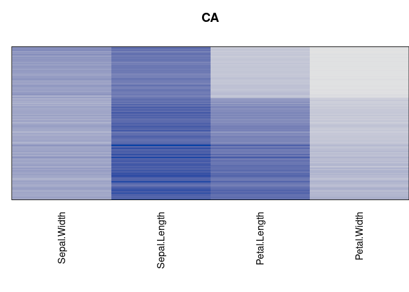

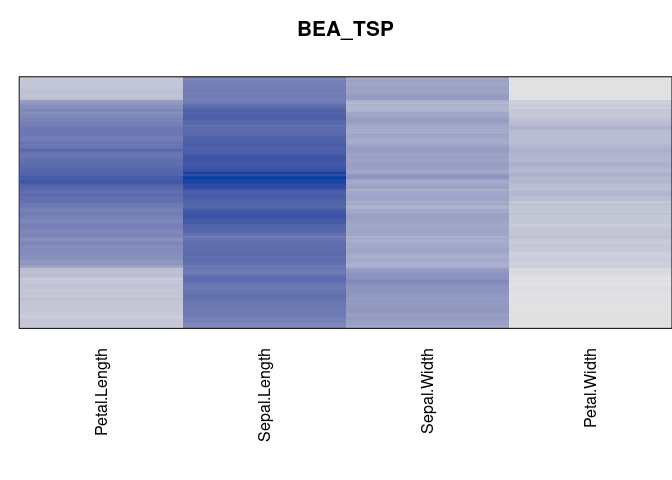

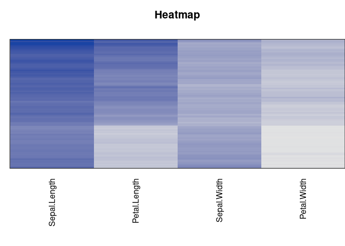

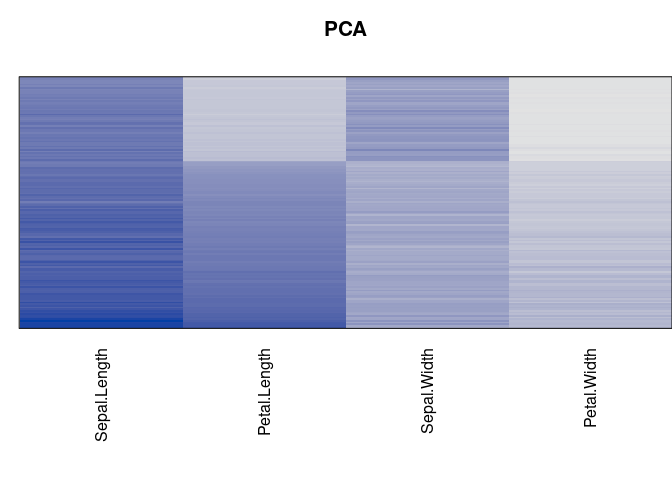

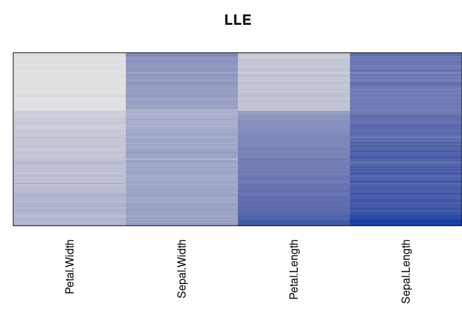

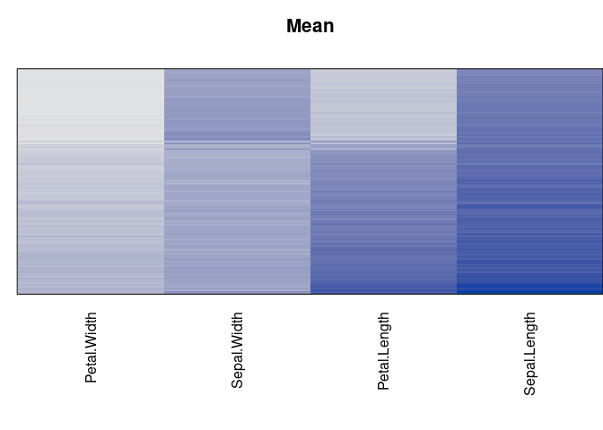

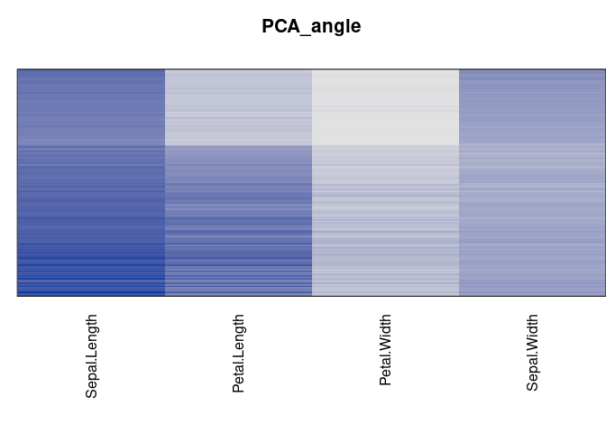

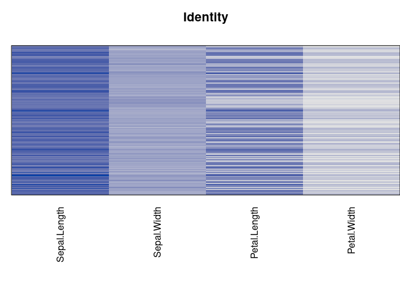

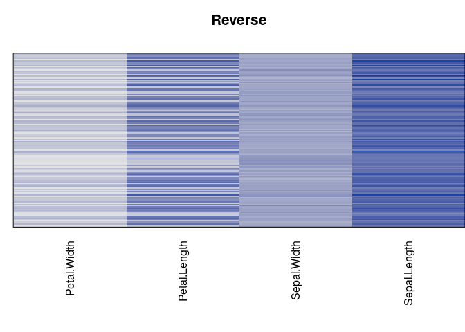

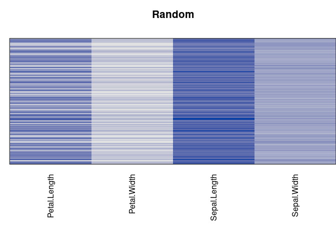

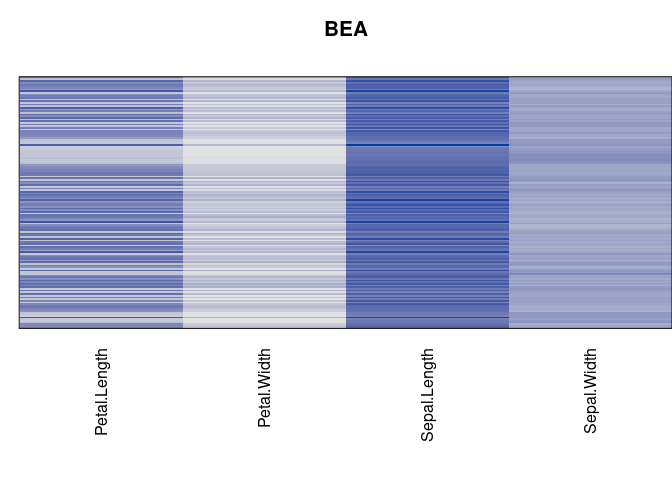

``` r
knitr::kable(criterion_mat)
```

|           |  time |      Cor_R |       ME | Moore_stress | Neumann_stress |
|:----------|------:|-----------:|---------:|-------------:|---------------:|
| CA        | 0.107 |  0.2221673 | 16401.60 |     20347.34 |        6934.24 |
| BEA_TSP   | 0.329 |  0.0332877 | 16186.05 |     16871.94 |        5687.98 |
| Heatmap   | 0.328 | -0.0433891 | 15130.21 |     12980.92 |        4395.22 |
| PCA       | 0.108 |  0.0485258 | 15120.47 |     13052.16 |        4484.76 |
| LLE       | 0.145 | -0.0465971 | 15111.45 |     13074.14 |        4486.04 |
| Mean      | 0.108 | -0.0498551 | 15106.98 |     12995.22 |        4532.48 |
| PCA_angle | 0.108 | -0.0392822 | 14291.69 |     16317.26 |        5564.00 |
| Identity  | 0.108 |  0.0073005 | 13994.13 |     22624.44 |        9061.18 |
| Reverse   | 0.108 |  0.0073005 | 13994.12 |     22624.44 |        9061.18 |
| Random    | 0.109 | -0.0233931 | 13476.69 |     38906.88 |       14101.16 |
| BEA       | 0.112 | -0.0057583 | 13314.34 |     40183.92 |       14746.58 |
