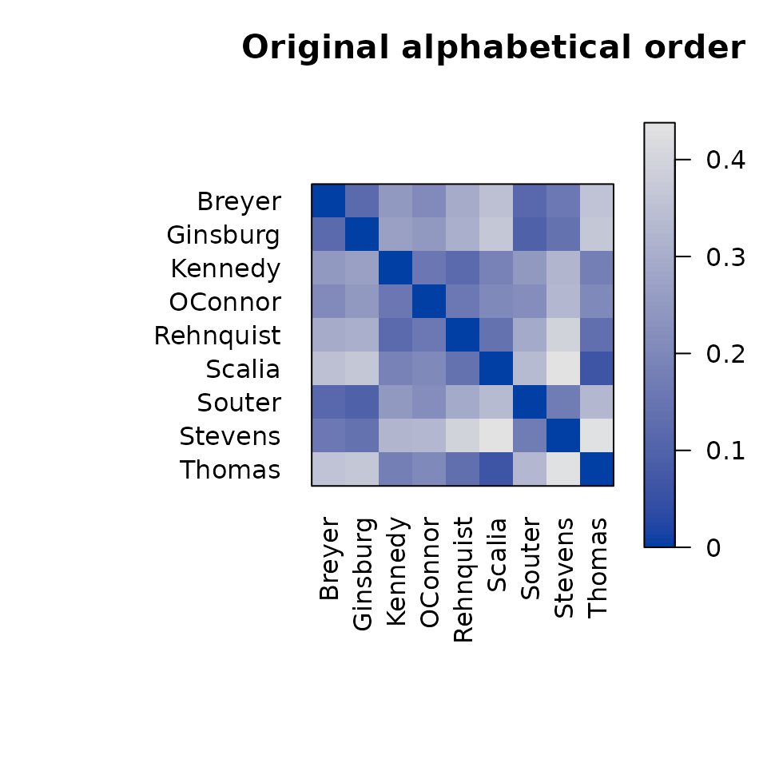
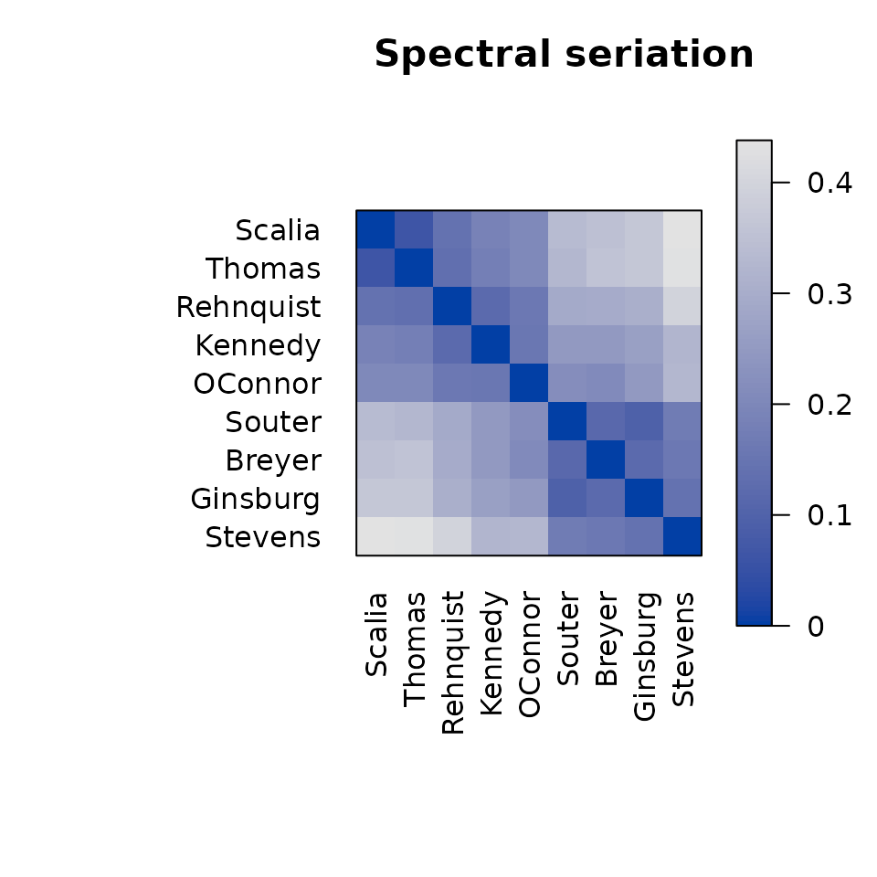
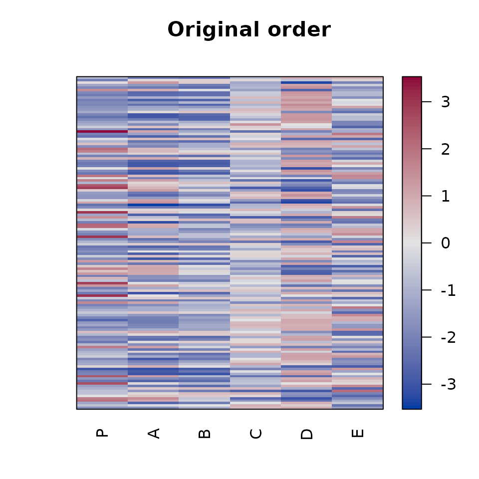
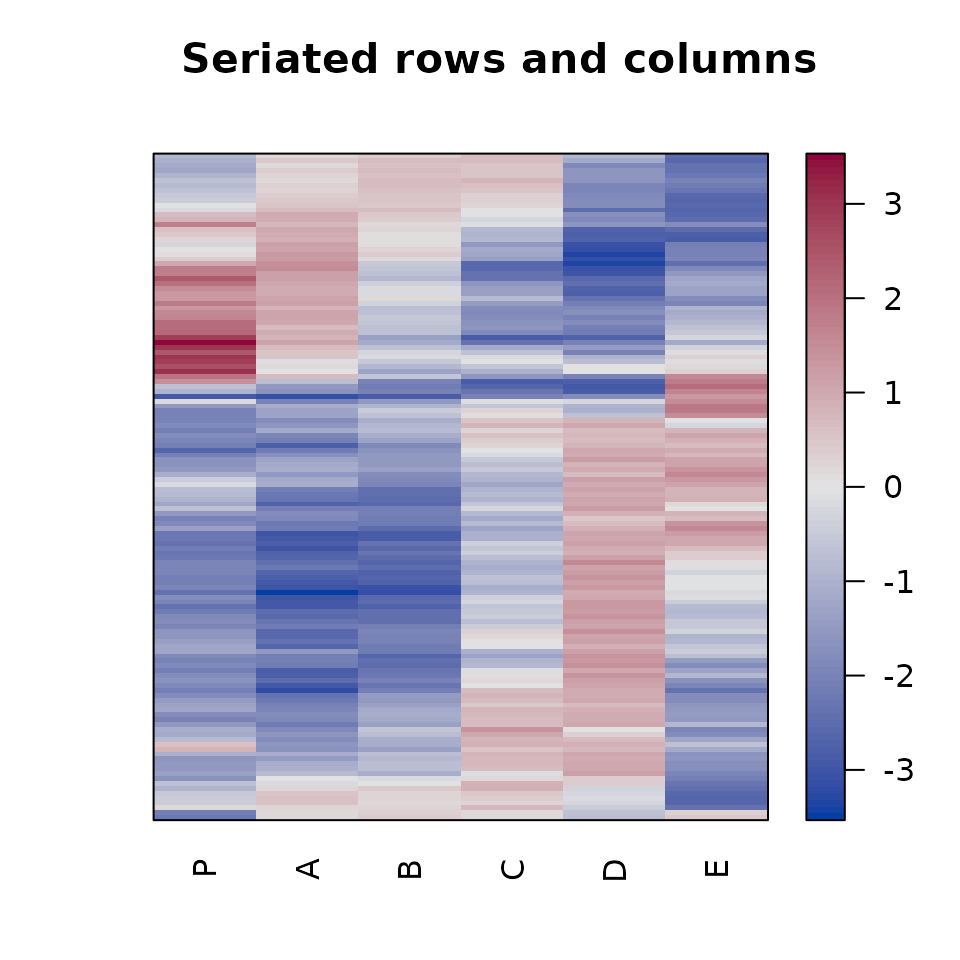

# Getting started with seriation

Seriation arranges objects in a linear order so that related objects are
close to one another. Reordering does not change the data; it changes
only how rows, columns, or objects are presented. A useful order can
expose clusters, gradients, and other structure that is difficult to see
in the original ordering.

Package `seriation` provides a common interface to many seriation
methods and tools for applying, assessing, and visualizing the resulting
orders. This vignette introduces the basic workflow:

1.  prepare a dissimilarity or data matrix,
2.  find an order with
    [`seriate()`](http://michael.hahsler.net/seriation/reference/seriate.md),
3.  inspect or apply the order, and
4.  visualize and assess the result.

## Installation

Install the released version from CRAN:

``` r

install.packages("seriation")
```

Load the package in each R session where you want to use it:

``` r

library(seriation)
```

## Seriate a dissimilarity matrix

We first use the `SupremeCourt` data. It contains pairwise disagreement
probabilities for nine U.S. Supreme Court justices. Because these values
are dissimilarities, we convert the symmetric matrix to an R `dist`
object.

``` r

data("SupremeCourt")
d <- as.dist(SupremeCourt)
d
#>            Breyer Ginsburg Kennedy OConnor Rehnquist  Scalia  Souter Stevens
#> Ginsburg  0.11966                                                           
#> Kennedy   0.25000  0.26709                                                  
#> OConnor   0.20940  0.25214 0.15598                                          
#> Rehnquist 0.29915  0.30769 0.12179 0.16239                                  
#> Scalia    0.35256  0.36966 0.18803 0.20726   0.14316                        
#> Souter    0.11752  0.09615 0.24790 0.22009   0.29274 0.33761                
#> Stevens   0.16239  0.14530 0.32692 0.32906   0.40171 0.43803 0.16880        
#> Thomas    0.35897  0.36752 0.17735 0.20513   0.13675 0.06624 0.33120 0.43590
```

The original rows and columns are alphabetical. A permutation image plot
shows the dissimilarities using color; darker cells represent smaller
dissimilarities.

``` r

pimage(d, main = "Original alphabetical order")
```



[`seriate()`](http://michael.hahsler.net/seriation/reference/seriate.md)
computes an order. Methods are selected by name. Here we use spectral
seriation, which is also the default for a `dist` object.

``` r

o <- seriate(d, method = "Spectral")
o
#> object of class 'ser_permutation', 'list'
#> contains permutation vectors for 1-mode data
#> 
#>   vector length seriation method
#> 1             9         Spectral
```

The result is a `ser_permutation` object.
[`get_order()`](http://michael.hahsler.net/seriation/reference/get_order.md)
extracts the ordinary integer permutation vector, with names showing the
labels in their new order.

``` r

get_order(o)
#>    Scalia    Thomas Rehnquist   Kennedy   OConnor    Souter    Breyer  Ginsburg 
#>         6         9         5         3         4         7         1         2 
#>   Stevens 
#>         8
```

The vector can be used for standard R subsetting. More generally,
[`permute()`](http://michael.hahsler.net/seriation/reference/permute.md)
applies a seriation order while preserving the input object’s class.

``` r

d_ordered <- permute(d, o)
as.matrix(d_ordered)[1:4, 1:4]
#>            Scalia  Thomas Rehnquist Kennedy
#> Scalia    0.00000 0.06624   0.14316 0.18803
#> Thomas    0.06624 0.00000   0.13675 0.17735
#> Rehnquist 0.14316 0.13675   0.00000 0.12179
#> Kennedy   0.18803 0.17735   0.12179 0.00000
```

Most plotting functions in the package accept the order directly, so it
is usually unnecessary to create a reordered copy just for
visualization.

``` r

pimage(d, order = o, main = "Spectral seriation")
```



The reordered plot places justices with similar voting patterns next to
one another and reveals two darker blocks along the diagonal.

## Assess an order

[`criterion()`](http://michael.hahsler.net/seriation/reference/criterion.md)
calculates objective measures for an order. The spectral method targets
the 2-Sum criterion. Both 2-Sum and Hamiltonian path length are loss
functions, so smaller values are better.

``` r

rbind(
  original = criterion(d, method = c("2SUM", "Path_length")),
  seriated = criterion(d, o, method = c("2SUM", "Path_length"))
)
#>              2SUM Path_length
#> original 871.9741     1.79059
#> seriated 810.8351     1.08333
```

Different methods optimize different criteria, and a method that
performs well for one goal need not be best for another. Use
[`criterion()`](http://michael.hahsler.net/seriation/reference/criterion.md)
to compare orders using measures that match the purpose of the analysis.

## Seriate a data matrix

For a rectangular matrix, rows and columns can be seriated separately.
The `Wood` data contains expression measurements for 136 genes at six
locations.

``` r

data("Wood")
dim(Wood)
#> [1] 136   6

o_matrix <- seriate(Wood, method = "Heatmap")
o_matrix
#> object of class 'ser_permutation', 'list'
#> contains permutation vectors for 2-mode data
#> 
#>   vector length seriation method
#> 1           136          Heatmap
#> 2             6          Heatmap
```

This order contains one permutation for each matrix dimension. Use
`dim = 1` for rows and `dim = 2` for columns.

``` r

head(get_order(o_matrix, dim = 1))
#> AI165492 AI166057 AI162004 AI164970 AI163151 AI166086 
#>      106      128       15       88       44      130
get_order(o_matrix, dim = 2)
#> P A B C D E 
#> 1 2 3 4 5 6
```

The same object can reorder both dimensions with
[`permute()`](http://michael.hahsler.net/seriation/reference/permute.md)
or can be passed directly to
[`pimage()`](http://michael.hahsler.net/seriation/reference/pimage.md).

``` r

pimage(Wood, main = "Original order")
pimage(Wood, order = o_matrix, main = "Seriated rows and columns")
```



To order only one dimension, use the `margin` argument. For example,
this orders rows using the first principal component and leaves columns
unchanged:

``` r

o_rows <- seriate(Wood, method = "PCA", margin = 1)
head(get_order(o_rows, dim = 1))
#> AI162940 AI163580 AI162710 AI162318 AI165903 AI164979 
#>       40       53       36       25      122       89
```

## Choose a method

Available methods depend on the input type. Use
[`list_seriation_methods()`](http://michael.hahsler.net/seriation/reference/registry_for_seriation_methods.md)
to discover valid method names and
[`get_seriation_method()`](http://michael.hahsler.net/seriation/reference/registry_for_seriation_methods.md)
to see a method’s description and control parameters.

``` r

head(list_seriation_methods("dist"))
#> [1] "ARSA"      "BBURCG"    "BBWRCG"    "Enumerate" "GSA"       "GW"
list_seriation_methods("matrix")
#>  [1] "AOE"              "BEA"              "BEA_TSP"          "BK_unconstrained"
#>  [5] "CA"               "Heatmap"          "Identity"         "LLE"             
#>  [9] "Mean"             "PCA"              "PCA_angle"        "Random"          
#> [13] "Reverse"
get_seriation_method("dist", "Spectral")
#> name:        Spectral
#> kind:        dist
#> optimizes:   2SUM (2-sum criterion)
#> randomized:  FALSE
#> description: Spectral seriation (Ding and He 2004) uses a relaxation to
#>              minimize the 2-Sum Problem (Barnard, Pothen, and Simon
#>              1993). It uses the order of the Fiedler vector of the
#>              similarity matrix's Laplacian.
#> control:
#> no parameters
```

Useful starting points are:

- `"Spectral"` for general dissimilarity data,
- `"OLO"` for a hierarchical clustering with optimal leaf ordering,
- `"TSP"` for a short path through the objects, and
- `"Heatmap"` for ordering the rows and columns of a data matrix using
  separate dissimilarities.

Some methods are randomized. For those methods, set a seed for
reproducibility and use the `rep` argument to keep the best result from
several restarts. Method-specific arguments can be supplied in `control`
or directly through `...`; see
[`?seriate`](http://michael.hahsler.net/seriation/reference/seriate.md)
and the method information returned by
[`get_seriation_method()`](http://michael.hahsler.net/seriation/reference/registry_for_seriation_methods.md).

## Where to go next

The package includes more focused guides:

- [Seriation
  methods](http://michael.hahsler.net/seriation/articles/seriation_methods.md)
  lists the available algorithms and their control parameters.
- [Seriation
  criteria](http://michael.hahsler.net/seriation/articles/seriation_criteria.md)
  describes measures for evaluating an order.
- [Heatmaps](http://michael.hahsler.net/seriation/articles/heatmaps.md)
  covers
  [`pimage()`](http://michael.hahsler.net/seriation/reference/pimage.md),
  [`hmap()`](http://michael.hahsler.net/seriation/reference/hmap.md),
  and
  [`gghmap()`](http://michael.hahsler.net/seriation/reference/hmap.md).
- [Correlation
  matrices](http://michael.hahsler.net/seriation/articles/correlation_matrix.md)
  shows methods designed for correlations.
- [Seriation and
  clustering](http://michael.hahsler.net/seriation/articles/clustering.md)
  demonstrates reordered dissimilarity plots and cluster visualization.

The help pages
[`?seriate`](http://michael.hahsler.net/seriation/reference/seriate.md),
[`?permute`](http://michael.hahsler.net/seriation/reference/permute.md),
[`?criterion`](http://michael.hahsler.net/seriation/reference/criterion.md),
and
[`?pimage`](http://michael.hahsler.net/seriation/reference/pimage.md)
provide the complete function reference.
