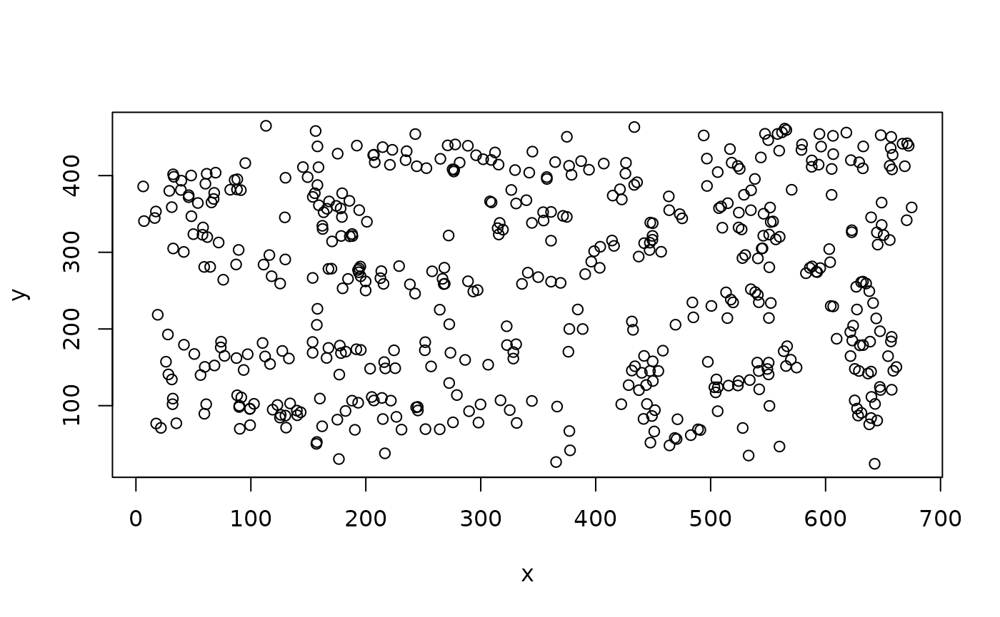
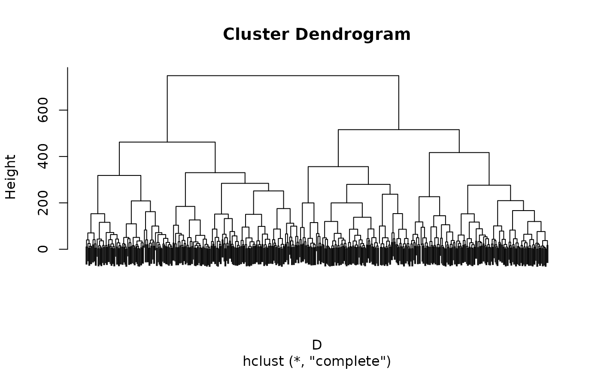
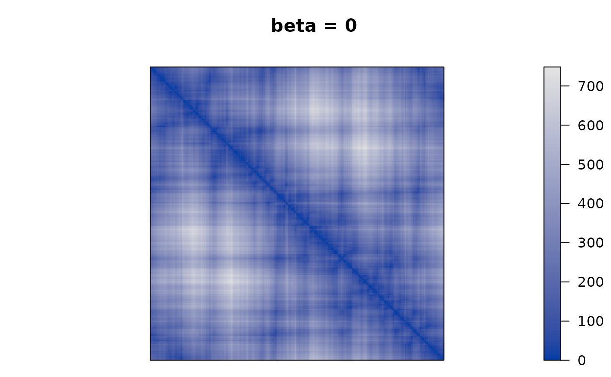
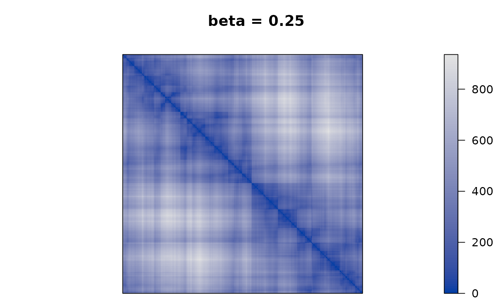
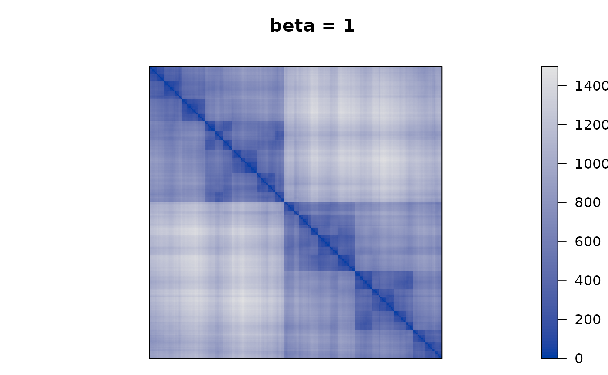
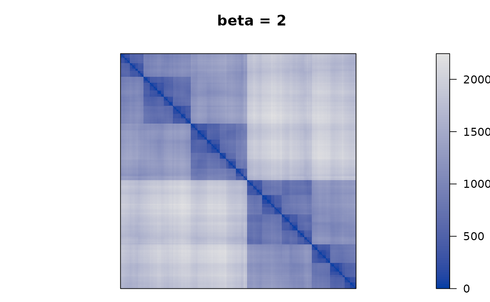
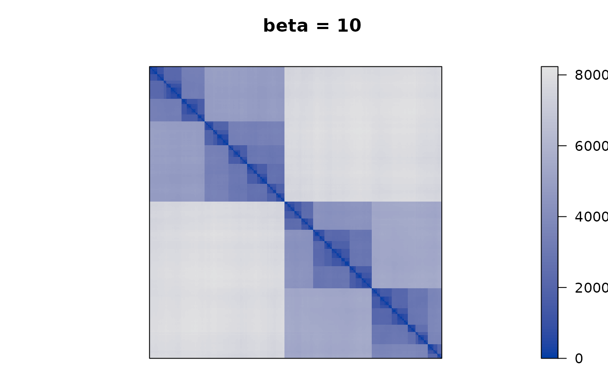

# How to use Tree-Penalized Path Length Criterion with Package seriation

## Introduction

The tree-penalized path length criterion was introduced in

> Denis A. Aliyev, Craig L. Zirbel, [Seriation using tree-penalized path
> length](https://doi.org/10.1016/j.ejor.2022.06.026), European Journal
> of Operational Research, Volume 305, Issue 2, 2023, Pages 617-629

This short vignette shows how to use the tree-penalized path length
criterion seriation with the R package `seriation`.

The idea of the tree-penalized path length criterion is to apply
TSP-based seriation to a modified distance matrix that incorporates
clustering structure into the distance information. This is achieved by
using the modified distance matrix:

``` math
T = D * \beta P
```
where $`P`$ contains the cophenetic distances for a hierarchical
clustering. By adjusting $`\beta`$, the seriation can move seamlessly
from a TSP based only on distances ($`\beta = 0`$) to a seriation order
that represents purely the clustering structure ($`\beta = \infty`$).

## Numeric Example

We use a sample of the Chameleon data set 7 which comes with the
seriation package and has a cluster structure.

``` r

library("seriation")
data("Chameleon")

x <- chameleon_ds7[sample(1:nrow(chameleon_ds7), 500), ]
plot(x)
```



We calculate the penalty matrix from complete-link hierarchical
clustering. The penalties are the cophenetic distances in the
dendrogram.

``` r

D <- dist(x)

hc <- hclust(D, method = "complete")
plot(hc, labels = FALSE)
```



``` r

P <- cophenetic(hc)
```

Next, we calculate the penalized distance matrix, perform seriation and
calculate the tree-penalized path length seriation criterion. The
seriation criterion can be calculated using the path length criterion on
the modified distance matrix $`F`$.

``` r

beta <- 1
F <- D + beta * P

o <- seriate(F, method = "TSP")
criterion(F, o, method = "Path_length")
```

    ## Path_length 
    ##    28689.18

Finally, we perform TSP seriation using different values for $`\beta`$
to see how the clustering structure emerges more and more in the
seriation result.

``` r

betas <- c(0, .25, .5, 1, 2, 10)

for (beta in betas) {
  F <- D + beta * P
  pimage(F, order = "TSP", main = paste("beta =", beta))
}
```



We see that as $`\beta`$ is increased the seriation follows more and
more the clustering. For $`\beta`$ approaching $`\infty`$, the seriation
order approaches optimal leaf ordering (OLO).
